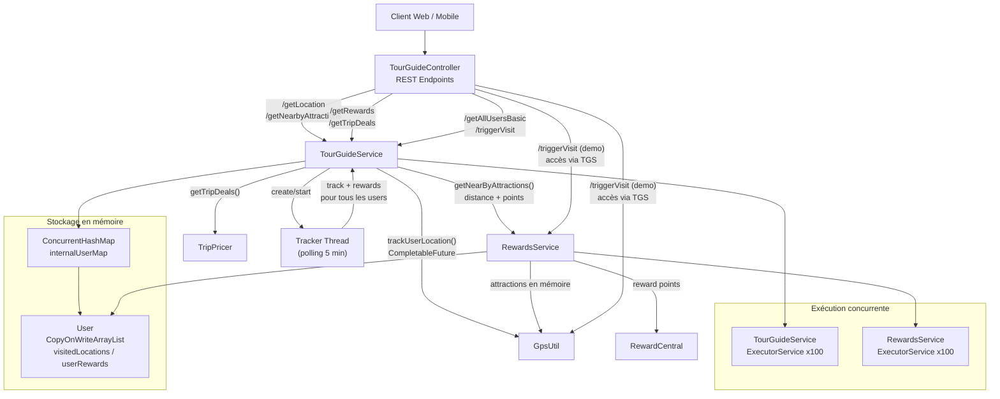

# TourGuide — Schéma technique (section 3.1)

## Lecture rapide

- **Entrée HTTP** : `TourGuideController`.
- **Orchestration métier** : `TourGuideService`.
- **Calcul des récompenses** : `RewardsService` + `RewardCentral`.
- **Offres de voyage** : `TripPricer`.
- **Tracking périodique** : `Tracker` en arrière-plan.
- **Concurrence** : `CompletableFuture` + pools de threads dédiés.
