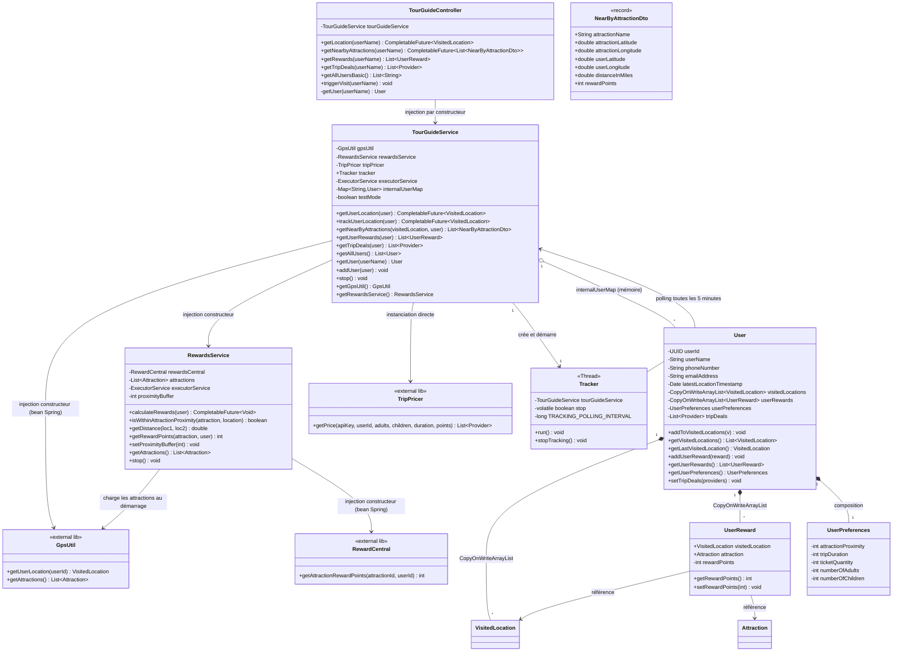

# TourGuide — Diagramme de classes UML

```mermaid
classDiagram
    direction TB

    class TourGuideController {
        -TourGuideService tourGuideService
        +getLocation(userName) CompletableFuture~VisitedLocation~
        +getNearbyAttractions(userName) CompletableFuture~List~NearByAttractionDto~~
        +getRewards(userName) List~UserReward~
        +getTripDeals(userName) List~Provider~
        +getAllUsersBasic() List~String~
        +triggerVisit(userName) void
        -getUser(userName) User
    }

    class TourGuideService {
        -GpsUtil gpsUtil
        -RewardsService rewardsService
        -TripPricer tripPricer
        +Tracker tracker
        -ExecutorService executorService
        -Map~String,User~ internalUserMap
        -boolean testMode
        +getUserLocation(user) CompletableFuture~VisitedLocation~
        +trackUserLocation(user) CompletableFuture~VisitedLocation~
        +getNearByAttractions(visitedLocation, user) List~NearByAttractionDto~
        +getUserRewards(user) List~UserReward~
        +getTripDeals(user) List~Provider~
        +getAllUsers() List~User~
        +getUser(userName) User
        +addUser(user) void
        +stop() void
        +getGpsUtil() GpsUtil
        +getRewardsService() RewardsService
    }

    class RewardsService {
        -RewardCentral rewardsCentral
        -List~Attraction~ attractions
        -ExecutorService executorService
        -int proximityBuffer
        +calculateRewards(user) CompletableFuture~Void~
        +isWithinAttractionProximity(attraction, location) boolean
        +getDistance(loc1, loc2) double
        +getRewardPoints(attraction, user) int
        +setProximityBuffer(int) void
        +getAttractions() List~Attraction~
        +stop() void
    }

    class Tracker {
        <<Thread>>
        -TourGuideService tourGuideService
        -volatile boolean stop
        -long TRACKING_POLLING_INTERVAL
        +run() void
        +stopTracking() void
    }

    class User {
        -UUID userId
        -String userName
        -String phoneNumber
        -String emailAddress
        -Date latestLocationTimestamp
        -CopyOnWriteArrayList~VisitedLocation~ visitedLocations
        -CopyOnWriteArrayList~UserReward~ userRewards
        -UserPreferences userPreferences
        -List~Provider~ tripDeals
        +addToVisitedLocations(v) void
        +getVisitedLocations() List~VisitedLocation~
        +getLastVisitedLocation() VisitedLocation
        +addUserReward(reward) void
        +getUserRewards() List~UserReward~
        +getUserPreferences() UserPreferences
        +setTripDeals(providers) void
    }

    class UserReward {
        +VisitedLocation visitedLocation
        +Attraction attraction
        -int rewardPoints
        +getRewardPoints() int
        +setRewardPoints(int) void
    }

    class UserPreferences {
        -int attractionProximity
        -int tripDuration
        -int ticketQuantity
        -int numberOfAdults
        -int numberOfChildren
    }

    class NearByAttractionDto {
        <<record>>
        +String attractionName
        +double attractionLatitude
        +double attractionLongitude
        +double userLatitude
        +double userLongitude
        +double distanceInMiles
        +int rewardPoints
    }

    class GpsUtil {
        <<external lib>>
        +getUserLocation(userId) VisitedLocation
        +getAttractions() List~Attraction~
    }

    class RewardCentral {
        <<external lib>>
        +getAttractionRewardPoints(attractionId, userId) int
    }

    class TripPricer {
        <<external lib>>
        +getPrice(apiKey, userId, adults, children, duration, points) List~Provider~
    }

    %% Relations applicatives
    TourGuideController --> TourGuideService : injection par constructeur

    TourGuideService --> GpsUtil : injection constructeur (bean Spring)
    TourGuideService --> RewardsService : injection constructeur
    TourGuideService --> TripPricer : instanciation directe
    TourGuideService "1" --> "1" Tracker : crée et démarre
    TourGuideService "1" o-- "*" User : internalUserMap (mémoire)

    RewardsService --> GpsUtil : charge les attractions au démarrage
    RewardsService --> RewardCentral : injection constructeur (bean Spring)

    Tracker --> TourGuideService : polling toutes les 5 minutes

    %% Relations de domaine
    User "1" *-- "*" VisitedLocation : CopyOnWriteArrayList
    User "1" *-- "*" UserReward : CopyOnWriteArrayList
    User "1" *-- "1" UserPreferences : composition

    UserReward --> VisitedLocation : référence
    UserReward --> Attraction : référence
```
